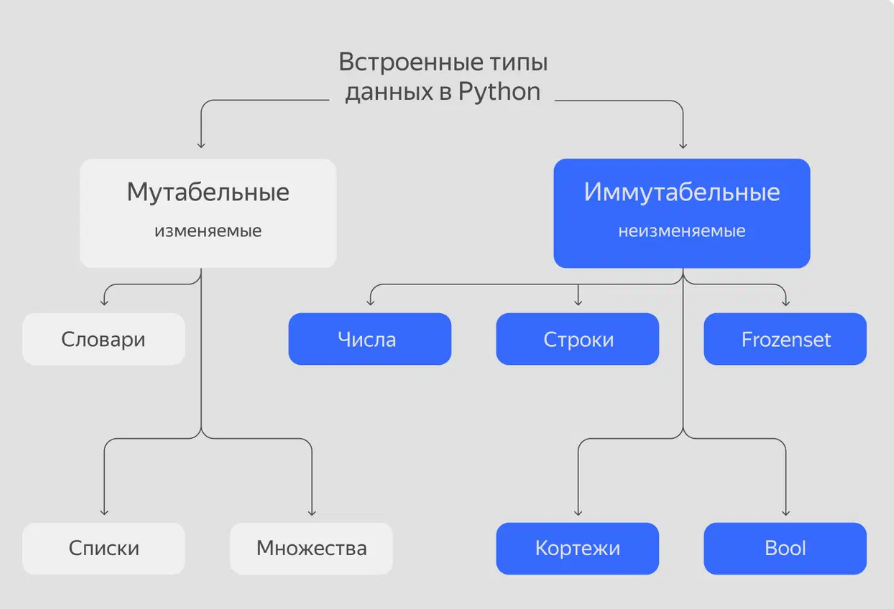

# ЛР 1. Введение в Python.
Операторы, типы данных в Python, команды ввода и вывода данных

## Цель лабораторной работы

- Познакомиться с базовыми типами данных
- Познакомиться с базовыми операторами

## Требования лабораторной работы

- Реализовать программы согласно заданиям

## Типы данных и операции над ними



### Числа

- int - целые числа вида 0, 1, 2 .....
- float - числа с плавающей запятой, имеют дробную часть, например, 2.71, 3.14
- complex - комплексные числа вида a + bi, где a и b - действительные числа, а i - мнимая единица.

### Строки(str)

Строка - это набор символов, заключенных в кавычка(" или ') в одной строке
или тройные кавычки можно записывать в нескольких строках

```Python
text_1 = "Это строка"

text_2 = 'И это строка'

text_3 = """
И
ЭТО
СтроКа
"""

text_4 = str(123421312) # тоже строка

text_1[0] # Это первый символ строки
text_1[-1] # Это последний символ строки
text_1[0:4] # С 1ого по 4ый "Это "
```

### Списки(List)
Список - тип данных, который хранит в себе произвольные объекты.
То есть в него можно записывать как числа, так и строки и т.д.

```Python
list_ch = [] # Пустой список
list_exmp = [1, "Hello", "w", 0, "rld"]
list_exmp_2 = list("это список")
```

### Множества(Set)
Множества - тип данных, который хранит в себе гарантированно не повторяемые значения

```Python
this_set = {"B", "A", "C"}

this_set_2 = {"B", "A", "C", "A"} # => Сохранит только {'B', 'C', 'A'}

this_set_3 = set() # Пустое множество
```

### Словари(Dict)
Словари - улучшенный вариант множеств, данные хранятся в виде хэша, для записи указывается ключ-значение.
То есть, чтобы найти значение, надо указать его ключ.

```Python
d1 = {
    'name': 'Test',
    'surname': 'Testov',
    'second_name': 'Petrovich'
}

d2 = dict() #Пустой словарь
d3 = {} # Пустой словарь
```

### Логический(bool)
Логический - тип данных, два значение - истина или ложь

```Python
pos = True
neg = False
```

### Преобразование типов данных

Иногда на практике нужно изменить тип данных объекта, например, отбросить дробную часть, или преобразовать строку в число.

```Python
value_1 = 123.5
value_1 = int(value_1) # Теперь будет 123

value_2 = "123"
value_2 = int(value_2)
```

## Операторы

### Арифметические операторы

#### Сложение(+)

```Python
t = 1 + 20 # 21
```

#### Вычитание(-)

```Python
t = 1 - 20 # -19
```

#### Умножение(*)

```Python
t = 1 * 20 # 20
```

#### Деление(/)

```Python
t = 1 / 20 # 0.05
```

#### Возведение в степень(**)

```Python
t = 1 ** 20 # 1
```

#### Деление без остатка(//)

```Python
t = 1 // 20 # 0
```

#### Деление без остатка(%)

```Python
t = 1 % 20 # 1
```

### Операторы сравнения

#### Меньше(<)

```Python
1 < 20 # True
```

#### Больше(>)

```Python
1 > 20 # False
```

#### Меньше равно(<=)

```Python
1 <= 20 # True
```

#### Больше(>=)

```Python
1 >= 20 # False
```

#### Равно(==)

```Python
3==3.0 # True
1==True # True
0.5==True # False
```

#### Равно(!=)

```Python
3!=3.0 # False
1!=0 # True
```

### Операторы присваивания

#### Равно(=)
Присваивает значение справа левой части. Стоит обратить внимание, что == используется для сравнения, а = — для присваивания.

```Python
a = 120
b = 2311
```

Также есть связка арифметического оператора и присваивания(+=, -=, /=, *=, ...)

Рассмотрим позже:
### Логические операторы

### Операторы принадлежности

### Операторы тождественности

### Битовые операторы

## Ввод и вывод данных

### print()

```Python
print("Вывожу данные")
t = 1
print(t)
```

### input()

```Python
t = input("Введи значение")
print(t)

t = int(input("Введи значение")) # Принимает только целые значения
print(t)
```

## Задания


**Задача 1:** Калькулятор среднего балла
Напишите программу, которая запрашивает у пользователя три оценки (целые числа), вычисляет их среднее арифметическое и выводит результат с точностью до двух знаков после запятой.


**Задача 2:** Обработка строки
Попросите пользователя ввести строку.
Выведите:
- Длину строки
- Первый и последний символ
- Строку в верхнем регистре
- Строку, повторённую 3 раза


**Задача 3:** Работа со списком

Создайте список из пяти произвольных элементов (чисел и строк). Выведите:
- Второй элемент списка
- Длину списка
- Последние три элемента
- Измените третий элемент на слово "Python"

**Задача 4:** Уникальные элементы

Попросите пользователя ввести несколько чисел через пробел.
Преобразуйте ввод в список, затем в множество.
Выведите оригинальный список и множество (чтобы показать удаление дубликатов).

**Задача 5:** Информация о студенте

Создайте словарь с ключами: имя, фамилия, возраст, курс.
Заполните его данными (можно вручную или через input).
Выведите все данные в виде:

```chatinput
Студент: Иван Иванов
Возраст: 20
Курс: 2
```

**Задача 6:** Проверка чётности

Программа запрашивает целое число. Определите, чётное оно или нет, и выведите True или False.

**Задача 7:** Простой калькулятор

Запросите два числа и операцию (+, -, *, /). Выполните операцию и выведите результат.
Если пользователь ввёл неизвестный оператор — выведите ошибку.
